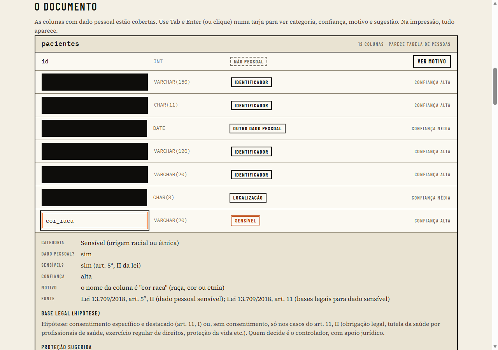

# Tarja

**Raio-X de LGPD para schemas SQL.** Você cola o `CREATE TABLE` do MySQL, a Tarja diz quais colunas guardam dado pessoal ou sensível, sugere como proteger e monta um rascunho do inventário de dados.

> **Em produção: https://tarja-lgpd.vercel.app** · Demonstração sem colar nada: https://tarja-lgpd.vercel.app/#exemplo



## O aviso que importa

- **Isto é apoio, não parecer jurídico.** Não substitui advogado nem DPO.
- **O motor não é IA.** São regras determinísticas e testáveis: dá para auditar cada decisão. Toda classificação vem com o motivo e a fonte.
- **Base legal, finalidade e prazo de retenção dependem do negócio.** A Tarja só sugere *hipóteses* de base legal, marcadas como hipótese. Finalidade fica em branco para você preencher. Retenção fica "a definir pelo controlador": a ferramenta nunca inventa prazo.

## O problema

Times pequenos guardam CPF, e-mail, endereço e até dado de saúde em tabelas sem saber o que têm. O inventário de dados que a LGPD pede (art. 37) nunca é feito porque começar dá preguiça. A Tarja lê o schema e entrega um primeiro rascunho em segundos.

## Como as regras funcionam

Cada coluna recebe **exatamente uma** classificação, com **nível de confiança** (alta, média, baixa) e o **motivo**, por exemplo: `o nome da coluna é "CPF"; o tipo VARCHAR(14) combina; o nome da tabela "clientes" indica pessoas`.

Categorias: identificador direto · localização · financeiro · criança/adolescente (indício) · sensível (com subtipo) · **outro dado pessoal** · **não identificado pelas regras**.

> A categoria "outro dado pessoal" (data de nascimento, gênero, profissão, foto...) não estava na lista original. Sem ela, essas colunas cairiam em "não identificado", um falso negativo de dado pessoal por construção.

A decisão usa o nome da coluna (com abreviações e inglês/português: `dt_nasc`, `birth_date`, `tel`, `phone`), o tipo SQL, o `COMMENT` e o **nome da tabela**: `produtos.nome` não é dado pessoal, `clientes.nome` é. As regras são **dados** em [`lib/lgpd/rules/pt-br.ts`](lib/lgpd/rules/pt-br.ts), não lógica espalhada. A pontuação está descrita no topo desse arquivo.

Regras de estrutura (não só de nome): uma **chave estrangeira declarada** é chave (se aponta para uma tabela de catálogo do mesmo DDL, mais ainda); a regra genérica "nome" só vale quando nenhuma regra mais específica casa (`nm_cidade` é cidade); e coluna sem nenhuma regra, numa tabela que tem identificador direto de pessoa, vira "outro dado pessoal" com confiança **baixa** e o motivo "contexto da tabela" (art. 5º, I: dado relacionado a pessoa identificada).

Nuances que a ferramenta respeita (e que têm teste):

- **CPF, RG e CNH são dado pessoal, mas NÃO são sensíveis.** A lista do art. 5º, II é fechada.
- **Dado financeiro não é sensível pela lei, mas é de alto risco.** O relatório marca os dois campos separados.
- **CNPJ é "depende":** pessoa jurídica não é dado pessoal, mas pode ser de empresário individual ou sócio.
- **Sexo/gênero não é vida sexual.** Orientação sexual é.
- Um booleano `ativo` **não** conta como exclusão lógica.
- **Foto é dado pessoal comum**; só vira biometria se houver indício de uso para identificar (biometria, reconhecimento facial).
- **Gênero é dado pessoal**; orientação sexual e vida sexual são sensíveis.

### Fontes

Cada regra aponta para a fonte que a sustenta. Tudo foi lido no texto oficial, com URL, artigo e data de acesso em [`docs/research/`](docs/research/):

- Lei 13.709/2018 (Planalto): arts. 5º, 6º, 7º, 11, 12, 13 § 4º, 14, 15, 16, 37, 38 e 46.
- ANPD: guia de segurança para agentes de pequeno porte (itens 45 e 46) e perguntas e respostas sobre o RIPD.
- **Não confirmado:** o modelo simplificado de registro de operações da ANPD (a página devolveu HTTP 401) e o guia de inventário do Governo Digital (HTTP 404). Por isso o relatório **não segue um modelo oficial específico**; as colunas vêm do art. 37 e do conteúdo mínimo do RIPD (art. 38). Detalhes em [`docs/research/04-inventario-e-registro-de-operacoes.md`](docs/research/04-inventario-e-registro-de-operacoes.md).

### Achados do schema

Cada achado tem critério explícito, gravidade, explicação e fonte:

| Achado | Quando aparece |
|---|---|
| `SEM_CICLO_DE_VIDA` (**informativo**) | Tabela com dado pessoal de confiança média ou alta sem coluna de data de criação nem de exclusão lógica (dificulta retenção e eliminação). Fora: tabela de ligação e de catálogo. Rebaixado a informativo: errou em 43% das vezes no externo v2. |
| `TEXTO_LIVRE` | Campo `TEXT` de nome típico (observação, descrição, comentário) numa tabela que já tem dado pessoal. |
| `SENSIVEL_SEM_PROTECAO` | Coluna sensível sem indício de hash, cifra ou tipo binário. É indício, não prova: o schema não mostra a cifra feita na aplicação. |
| `PESSOAL_EM_LOG` | Dado pessoal em tabela de log, auditoria ou histórico. |
| `INDICIO_MENOR` | Coluna de responsável legal ou menor de idade, tabela de alunos, ou data de nascimento em tabela de escola ou de responsável. |

## Precisão e recall

> **Fora dos nomes que as regras conhecem, a Tarja deixou passar cerca de 1 em cada 10 colunas com dado pessoal, e marcou a mais cerca de 1 em cada 4 colunas que apontou** (medição v2, uma única execução). "Não identificado pelas regras" quer dizer que a Tarja não achou pista, não que não há dado pessoal: revise. Essa frase é gerada por `lib/lgpd/medicao.ts` e conferida por um teste contra o registro da execução.

**Leia isto antes dos números.** Eu escrevi os schemas de teste, os gabaritos *e* as regras. Um classificador por nome de coluna afinado nos nomes que o próprio autor conhece vai bem nesses nomes. Por isso há vários corpora, e cada um vale de um jeito:

| Corpus | O que é | Papel |
|---|---|---|
| Desenvolvimento (e-commerce, clínica, RH, escola, fintech) | Schemas meus. As regras foram escritas conhecendo esses nomes. | Desenvolvimento. **Otimista.** |
| Validação v1 (outros 5 schemas fictícios) | Schemas meus. Rodou uma vez, e os erros dela orientaram uma correção. | **Queimada**: hoje é desenvolvimento (`docs/results/validacao-v1-queimada.md`). |
| Externo v1 (Sakila, Employees, WordPress) | Schemas públicos que não escrevi. | Fora da amostra só na primeira rodada; depois virou desenvolvimento. |
| **Validação v2** (5 schemas fictícios novos, com armadilhas) | Escritos **e congelados antes** das mudanças de regra que avaliam. | **Validação. Uma única execução.** |
| **Externo v2** (Northwind, Chinook, OpenEMR) | Schemas públicos que não escrevi, sem nenhum em comum com o v1. OpenEMR traz dado de saúde e de responsável legal. | **Validação externa. Uma única execução.** |

Os v2 têm hash congelado (um teste falha se alguém mexer) e o script recusa a segunda execução. Colunas com "depende" no gabarito ficam fora de todas as métricas e são listadas à parte. A métrica binária conta o "depende" da Tarja como positivo, porque deixar passar dado pessoal é pior do que marcar a mais.

### Dado pessoal vs não pessoal, rodada por rodada (nada foi apagado)

| Corpus | Rodada | Colunas | Precisão | Recall | Falsos negativos | Falsos positivos |
|---|---|---:|---:|---:|---:|---:|
| Desenvolvimento | primeira | 373 | 99% | 97% | 5 | 1 |
| Desenvolvimento | depois da rodada 3 | 373 | 96% | 99% | 2 | 7 |
| Validação v1 | execução 1 (antes de qualquer correção) | 247 | 100% | 99% | 1 | 0 |
| Validação v1 | depois da rodada 3 *(queimada)* | 247 | 91% | 100% | 0 | 12 |
| Externo v1 | **primeira rodada (fora da amostra)** | 137 | 90% | 76% | 8 | 3 |
| Externo v1 | depois da rodada 3 *(desenvolvimento)* | 137 | 82% | 94% | 2 | 7 |
| **Validação v2** | **única execução** | 239 | **87%** | **94%** | 6 | 16 |
| **Externo v2** | **única execução** | 377 | **73%** | **90%** | 14 | 49 |

**A leitura honesta:**

- A regra de **contexto da tabela** (coluna de nome comum, em tabela que tem CPF, e-mail ou nome de pessoa, vira "outro dado pessoal" com confiança baixa) subiu o recall e derrubou a precisão: de 1 alarme falso em 100 marcações para cerca de 1 em 4 no externo v2. É uma troca declarada: deixar passar dado pessoal é pior do que marcar a mais. As marcações vindas dessa regra têm confiança **baixa** e motivo "contexto da tabela", então dá para filtrar.
- O recall do externo v2 (90%) é o número que mais se parece com um schema de terceiros. O de 94% na validação v2 vem de schemas meus, mesmo congelados antes.
- **Não há maneira de saber o desempenho no seu schema sem olhar o seu schema.** Nomes opacos, abreviações locais e idiomas fora do português e do inglês vão piorar.

### Por categoria (única execução dos v2)

| Categoria | Validação v2 (suporte · P · R) | Externo v2 (suporte · P · R) |
|---|---|---|
| Identificador direto | 42 · 88% · 88% | 68 · 81% · 56% |
| Localização | 16 · 100% · 88% | 33 · 95% · 61% |
| Financeiro | 21 · 100% · 76% | 1 · 100% · 100% |
| **Sensível** | 11 · 80% · 73% | 11 · 83% · **45%** |
| **Criança/adolescente (indício)** | 4 · 67% · 100% | 11 · n/d · **0%** |
| Outro dado pessoal | 15 · 48% · 100% | 23 · 20% · 91% |
| Não identificado pelas regras | 130 · 95% · 88% | 230 · 93% · 79% |

Recall por categoria é mais baixo que o recall binário porque errar só a categoria ainda conta como "achou dado pessoal" na binária.

**Categorias fracas, sem maquiagem:**

- **Sensível (recall 45% no externo v2) e criança/adolescente (0%).** O OpenEMR trouxe a primeira medida que não é minha para essas duas categorias, e ela é ruim: `prescriptions.drug`, `dosage` e `indication` passam sem marcar (não têm palavra de saúde no nome), e `guardiansname` e similares não são separados pelo tokenizador. Os números dessas duas categorias nos meus corpora (100% no desenvolvimento) **não valem como generalização**.
- **Identificador direto (recall 56% no externo v2):** tabelas de fornecedor/empresa (`suppliers` no Northwind) são lidas como "coisa", então a pessoa de contato passa; e `fname`, `lname`, `ss`, `DOB` (nomes curtos do OpenEMR) estão fora do dicionário.
- **Outro dado pessoal (precisão 20% no externo v2):** é a regra de contexto da tabela marcando muita coluna a mais (`Track.UnitPrice`-tipo de coluna em tabela com pessoa, campos de configuração do OpenEMR). Confiança baixa por desenho.
- **Armadilhas que a Tarja errou de propósito no v2:** saúde e raça de **animal** (`pets.raca`, `atendimentos.diagnostico`) viram dado sensível, e `tutor_id` (dono do pet) vira "indício de criança". A Tarja não distingue humano de animal.
- **`SEM_CICLO_DE_VIDA` virou "informativo".** A precisão dele no externo v2 foi 57%, abaixo do mínimo de 60% que definimos.

### Achados do schema (única execução dos v2)

| Achado | Validação v2 (VP · FP · FN) | Externo v2 (VP · FP · FN) |
|---|---|---|
| `SENSIVEL_SEM_PROTECAO` | 7 · 2 · 5 | 5 · 2 · 31 |
| `TEXTO_LIVRE` | 1 · 1 · 0 | 6 · 1 · 2 |
| `PESSOAL_EM_LOG` | 3 · 0 · 0 | (nenhum esperado) |
| `INDICIO_MENOR` | 1 · 2 · 0 | 0 · 0 · 1 |
| `SEM_CICLO_DE_VIDA` (informativo) | 1 · 1 · 0 | 4 · 3 · 1 |

O recall baixo de `SENSIVEL_SEM_PROTECAO` é consequência direta do recall baixo de "sensível": achado nasce da classificação.

### Onde estão os erros

As listas completas, com o motivo de cada erro e os falsos negativos de dado pessoal primeiro, estão em [`docs/results/`](docs/results/):

- [`validation-v2.md`](docs/results/validation-v2.md) e [`external-v2.md`](docs/results/external-v2.md): as execuções únicas.
- [`historico-de-ajustes.md`](docs/results/historico-de-ajustes.md): toda mudança de regra com o motivo, e o que **não** foi corrigido de propósito.
- [`validacao-v1-queimada.md`](docs/results/validacao-v1-queimada.md), [`dev-primeira-rodada.md`](docs/results/dev-primeira-rodada.md), [`external-primeira-rodada.md`](docs/results/external-primeira-rodada.md): os resultados antigos, mantidos.
- [`docs/validation-runs-v2.md`](docs/validation-runs-v2.md): quantas vezes cada corpus v2 rodou e em qual commit.

## Limitações (o que a Tarja NÃO faz)

- **Só MySQL, só `CREATE TABLE`.** `ALTER TABLE`, views, triggers, procedimentos e outros bancos (Postgres etc.) ficam de fora. O parser reconhece e lista o que ignorou.
- **Heurística por nome.** Não olha dado nenhum, só o schema: nome da coluna, tipo, `COMMENT` e nome da tabela. Coluna com nome opaco (`campo1`, `info`) só é pega se o `COMMENT` ajudar.
- **Não sabe o que a aplicação faz.** Cifra, mascaramento e controle de acesso feitos no código não aparecem no schema.
- **Não conhece o seu negócio.** Finalidade, base legal e retenção são seus.
- **Texto livre** (`observacao`, `descricao`) pode ter qualquer dado pessoal dentro. A Tarja só avisa.
- **Português e inglês.** Outros idiomas não têm vocabulário.
- **Não separa palavras coladas em minúsculas** (`guardiansname`, `fname`) nem conhece siglas locais.
- **Não distingue humano de animal** (`pets.raca`) nem pessoa de empresa dentro da mesma tabela de contatos.
- **`ALTER TABLE ... ADD FOREIGN KEY` não é lido** (só `CREATE TABLE`), então FKs declaradas por ALTER não contam como estrutura.
- **Dicionário pequeno de vida funcional, cargos e datas.** É aí que mais erra.

## Decisões técnicas

- **Parser próprio** (`lib/sql/`), em TypeScript puro, sem DOM, sem React e sem biblioteca de parser. Tokenizador linear, sem regex com quantificador aninhado (sem backtracking catastrófico). Erro de sintaxe nunca derruba: mostra o trecho e analisa o que dá. Limites de tabelas, colunas, identificador e de entrada (1 MB medido em **bytes UTF-8**).
- **Regras como dados** (`lib/lgpd/rules/`), funções pequenas e puras no motor. Sem `Math.random`, `Date.now` nem `new Date()` (um teste varre o código).
- **Privacidade por construção:** o motor não faz rede. Um teste estático proíbe `fetch`, `XMLHttpRequest`, `sendBeacon`, `WebSocket`, `innerHTML`, `localStorage` e afins no código da aplicação, e um teste em execução intercepta essas APIs e confirma zero chamadas. A CSP restritiva (`connect-src 'none'`), a página "como verificar" e o deploy vêm com a interface.
- **Exportação segura:** CSV com proteção contra injeção de fórmula em planilha; Markdown com escape de `|`, quebra de linha e HTML.
- **Testes:** Vitest e fast-check. Suíte rápida (`npm test`) em todo commit; suíte lenta (`npm run test:slow`: corpus, 1 MB hostil, cobertura com limite de 90/90/85) em job separado do CI.

## Rodando

```bash
npm install
npm test                      # suíte rápida (todo commit)
npm run test:slow             # baixa os schemas copyleft, roda o corpus completo e confere a cobertura mínima
npm run corpus:metrics        # desenvolvimento
npm run corpus:fetch          # baixa WordPress e OpenEMR (GPL) para corpus/**/.fetched/, conferindo o hash
npm run corpus:validacao-v2   # UMA única execução por corpus; o script recusa a segunda
npm run corpus:externo-v2
```

## Licenças

Código sob MIT. Os schemas de terceiros mantêm as licenças originais: Sakila (BSD), Employees (CC BY-SA 3.0), Northwind/MyWind (BSD) e Chinook (MIT) estão no repositório com a atribuição; WordPress (GPL v2+) e OpenEMR (GPL v3) **não** estão: são baixados por `npm run corpus:fetch`. Detalhes em [`corpus/external/NOTICE.md`](corpus/external/NOTICE.md) e [`corpus/external-v2/NOTICE.md`](corpus/external-v2/NOTICE.md).
